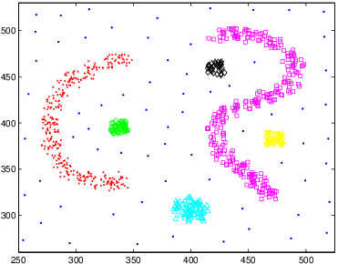

# DBCV
Density-Based Clustering Validation

This is the source code employed to compute DBCV (Density-Based Clustering Validation) in our following paper:

*Density-Based Clustering Validation. Davoud Moulavi, Pablo A. Jaskowiak, Ricardo J. G. B. Campello, Arthur Zimek, and Jörg Sander. Proceedings of the 2014 SIAM International Conference on Data Mining (SDM). 2014, 839-847*

You can read the paper here: https://epubs.siam.org/doi/10.1137/1.9781611973440.96

The Matlab source code from this repository is from [Davoud Moulavi](https://scholar.google.com.br/citations?user=VoJmF8QAAAAJ) and [Pablo A. Jaskowiak](https://scholar.google.com.br/citations?user=by6xRbkAAAAJ). 

## Usage

For calculating the DBCV Validation Index of a partition run dbcv.m. The output of the function is the DBCV index for the corresponding partition. Its values are within -1 and +1. DBCV is a *maximization* index, which means that higher values correspond to better partitions, according to the index. The necessary inputs are the dataset (without labels) and the partition, which correspond to a clustering solution, that is, labels. The dataset should be formatted with each line corresponding to an object, with columns corresponding to features. The partition is a 1-dimensional array with cluster assignments, in integer format. The number of labels must match the number of objects in the dataset. 

**Important note**: noise is represented by label 0 (zero). Therefore, any object with label of zero in the partition is considered as noise. By definition, singletons (clusters with a single object) will be treated as noise by the measure (please see the paper for discussion on this topic).


### Example: Computing DBCV on a Synthetic Dataset

Assuming you are running Matlab and your current working directory is *src*.

```
%first we load the dataset
load ../data/dataset_1.txt

%we run dbcv on the dataset (first two columns),
%passing its ground truth as partition (column 3).
val = dbcv(dataset_1(:,-3),dataset_1(:,3))

%val should be 0.6149. Note that this is low given
%that some noise points actually overlap the clusters.

%we can also plot the dataset with the following
plot_clusters(dataset_1(:,1:2),dataset_1(:,3))

%that's all :)
```


## Datasets

In the folder *data* you can find the four synthetic datasets employed in our paper. These are shown below. Plots in PDF and PNG can be found in the folder *plots*. Please, if you use any of these datasets in a publication, cite *both* our paper and this repository.

<p align="center">


</p>

<p align="center">


</p>


## Other resources

You can also find an implementation of DBCV in the R Package [clusterConfusion](https://github.com/pajaskowiak/clusterConfusion).

## Disclaimer 

This prototype was developed for research purposes only. It was *by no means* implemented to optimize computational performance. Therefore, its computational performance should not be evaluated and/or fairly compared to that of other measures.

## Contact

If you find any bugs or problems, please, get in touch. You can reach me [here](https://andretta.paginas.ufsc.br/).
